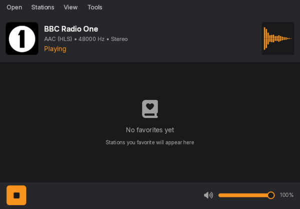
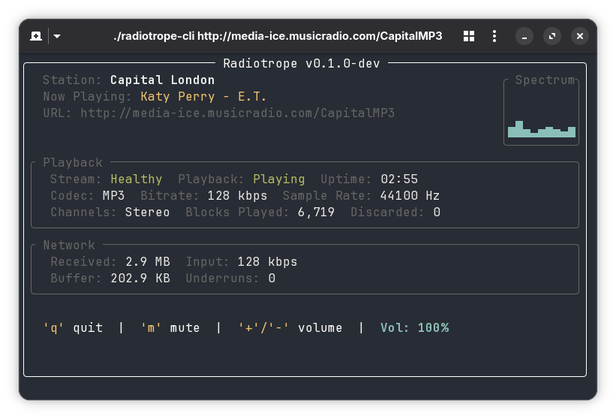

# Radiotrope

[](https://github.com/goten002/radiotrope/actions/workflows/ci.yml)
[](LICENSE)

An AI agent-enabled internet radio player built with Rust and [Slint](https://slint.dev). Control playback from your AI assistant via the [Model Context Protocol (MCP)](https://modelcontextprotocol.io), or use the desktop GUI and terminal interfaces directly.



## Features

- **MCP server** - AI agents (Claude, etc.) can play stations, control volume, and query status through natural language
- **Desktop GUI** - built with Slint, dark/light themes, real-time spectrum visualization, stream statistics
- **Terminal player** - lightweight TUI with ratatui for headless/SSH use
- **Resilient streaming** - automatic reconnection with exponential backoff, stall detection, health monitoring
- **Wide format support** - MP3, AAC, HE-AAC, Vorbis, Opus, FLAC over ICY, HLS, and HTTP

## MCP Integration

Radiotrope exposes an MCP server that lets AI agents control the player. Add it to your MCP client configuration:

```json
{
  "mcpServers": {
    "radiotrope": {
      "command": "radiotrope",
      "args": ["--mcp"]
    }
  }
}
```

### Available Tools

| Tool | Description |
|------|-------------|
| `play_station` | Play a radio station by URL |
| `stop` | Stop playback |
| `set_volume` | Set volume (0-100) |
| `get_status` | Get playback state, track info, and volume |
| `search_stations` | Search for radio stations by name |

Once configured, you can ask your AI assistant things like *"play BBC Radio 1"*, *"search for jazz stations"*, *"set volume to 50"*, or *"what's currently playing?"*.

## Supported Formats

### Stream Protocols

| Protocol | Description |
|----------|-------------|
| ICY | Icecast/Shoutcast with metadata extraction |
| HLS | MPEG-TS segment demuxing |
| Direct HTTP | Plain HTTP/HTTPS audio streams |
| PLS / M3U | Playlist resolution with recursive following |

### Audio Codecs

| Codec | Provider |
|-------|----------|
| MP3 | symphonia |
| AAC-LC | fdk-aac |
| HE-AAC (SBR) | fdk-aac |
| OGG Vorbis | symphonia |
| FLAC | symphonia |
| WAV/PCM | symphonia |
| Opus | libopus (bundled) |

### Metadata

| Format | Status | Description |
|--------|--------|-------------|
| ICY (Icecast/Shoutcast) | Supported | Artist/title extraction from in-band ICY metadata blocks |
| ID3v1/ID3v2 | Planned | Embedded tags in MP3 streams (artist, title, album, genre, etc.) |

## Architecture

The project is a Cargo workspace with three crates:

| Crate | Type | Description |
|-------|------|-------------|
| `radiotrope` | Library | Streaming engine: stream resolution, audio decoding, buffering, health monitoring |
| `radiotrope-app` | Binary | Desktop GUI with MCP server, built with [Slint](https://slint.dev) |
| `radiotrope-cli` | Binary | Terminal player built with [ratatui](https://github.com/ratatui/ratatui) |

The engine is designed to be embedded in any Rust application. Both the GUI and CLI are consumers of the library API.

### Engine Highlights

| Feature | Description |
|---------|-------------|
| Stream resolution | Automatic protocol detection, playlist unwinding, format probing |
| Decoupled buffering | Producer-consumer architecture isolating network I/O from audio decoding |
| Health monitoring | Stall detection, no-audio timeout, stream failure reporting |
| Error recovery | Automatic reconnection with exponential backoff (ICY and HLS) |
| Spectrum analyzer | Real-time FFT-based frequency analysis |
| Event system | Channel-based events for playback state, metadata, and health changes |

## Installation

### From source

```bash
git clone https://github.com/goten002/radiotrope.git
cd radiotrope
cargo build --release
```

Binaries will be at:
- `target/release/radiotrope` - Desktop GUI + MCP server
- `target/release/radiotrope-cli` - Terminal player

### Dependencies (Linux)

Radiotrope uses rodio for audio output, which requires ALSA on Linux:

```bash
# Debian/Ubuntu
sudo apt install libasound2-dev

# Arch/Manjaro
sudo pacman -S alsa-lib

# Fedora
sudo dnf install alsa-lib-devel
```

## Usage

### Desktop GUI

```bash
radiotrope
```

### MCP mode (for AI agents)

```bash
radiotrope --mcp
```

### Terminal player

```bash
radiotrope-cli <URL>
```



## Roadmap

- [ ] Favorites management
- [x] Station search and browsing (Radio Browser API)
- [ ] ID3 tag metadata extraction (MP3 streams)
- [ ] System tray integration
- [ ] Audio recording to file
- [ ] Equalizer and audio effects (DSP chain)

## License

Radiotrope is provided under the MIT license. See [LICENSE](LICENSE) for details.

This project includes third-party dependencies with different licenses.
See [THIRD-PARTY-LICENSES](THIRD-PARTY-LICENSES) for details.
